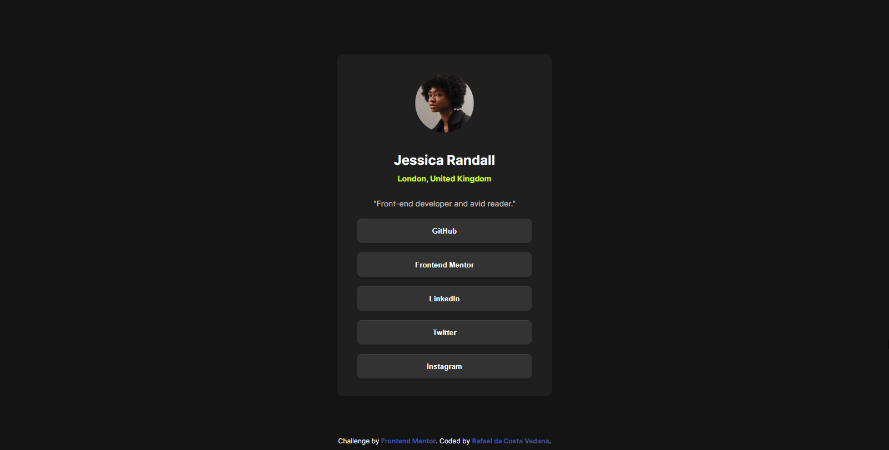

# Frontend Mentor - Social links profile solution

## Overview

This project is a solution to the Social Links Profile challenge on Frontend Mentor. The goal is to create a responsive profile page with interactive social links. I enjoyed working on this project, as it allowed me to practice my HTML and CSS skills.

### The challenge

The challenge required creating hover and focus states for all interactive elements on the page. I used CSS to achieve this, utilizing pseudo-classes like :hover and :focus. I encountered some issues with accessibility, but I was able to resolve them by using ARIA attributes."

### Screenshot

### Links

- Solution URL: [https://github.com/rafaeldacostavedana/social-links-profile-main]
- Live Site URL: [https://rafaeldacostavedana.github.io/social-links-profile-main/]

## My process

Nothing special, started finishing the HTMl and then I start the CSS styles, added some little things to make the project more alive and thats it.

### Built with

- Semantic HTML5 markup
- CSS custom properties
- Flexbox
- CSS Grid
- Mobile-first workflow

### What I learned

Nothing Special, I was just doing for fun. Is the first challange so I picked an easy one, just to test and recap the basics

### Continued development

In future projects, I would like to continue focusing on improving my CSS skills, particularly in the area of accessibility.

## Author

- Website - [Rafael da Costa Vedana](https://www.your-site.com)
- Frontend Mentor - [@rafaeldacostavedana](https://www.frontendmentor.io/profile/yourusername)
